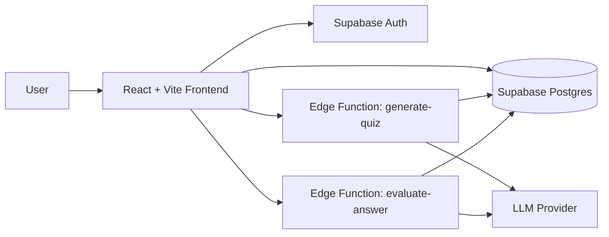
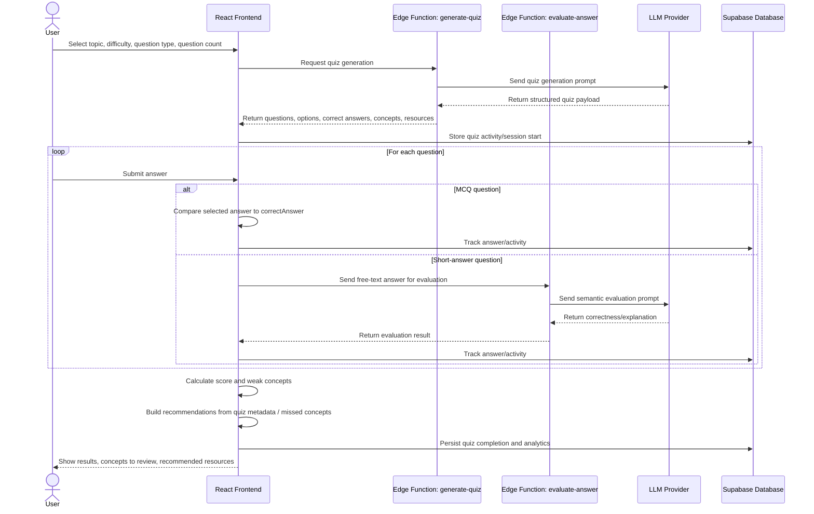
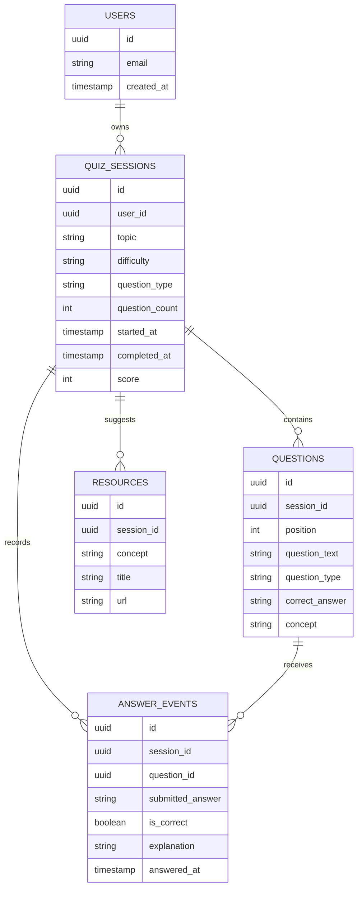

# QuizIQ – Architecture Overview

## Overview
QuizIQ is an AI-powered quiz application that helps users generate quizzes on any topic and evaluate answers with AI-assisted feedback. Users can select a topic, difficulty, question type, and question count, then complete the quiz and receive a score, explanations, concept-level feedback, and recommended resources.

This project was **designed and directed by the repository owner**, including the product concept, flow, and architecture intent. The implementation was **created with AI assistance using the Lovable platform**, then refined through prompting, review, and repository management.

---

## Tech Stack

### Frontend
- React
- TypeScript
- Vite
- Tailwind CSS
- shadcn/ui

### Backend / Platform
- Supabase
- Supabase Auth
- Supabase Postgres
- Supabase Edge Functions

### AI Layer
- LLM provider API for:
  - quiz generation
  - short-answer evaluation
  - explanation generation

### Development Workflow
- Lovable for AI-assisted implementation
- GitHub for source control and project management

---

## High-Level Architecture

### Architecture Summary
- The **React frontend** manages the user experience, quiz flow, and results display.
- **Supabase Auth** manages authentication and user identity.
- **Supabase Postgres** stores quiz sessions, answers, and analytics.
- The **generate-quiz** edge function creates structured quiz content through the LLM.
- The **evaluate-answer** edge function grades short-answer responses through the LLM.
- The LLM is accessed through backend functions rather than directly from the client.

---

## End-to-End Quiz Flow

---

## Conceptual Data Model (ERD)

### ERD Notes
This ERD is conceptual and intended to show the main product entities and relationships:
- a user can have many quiz sessions
- each quiz session contains multiple questions
- each question can have answer activity recorded
- quiz sessions can produce learning resources and recommendations

---

## Security and Design Notes
- Authentication is handled through **Supabase Auth**
- User data should be protected through **Row Level Security**
- LLM API keys should remain on the backend inside **edge functions**
- AI output should be treated as untrusted and validated where possible

---

## AI-Assisted Development Note
This application follows a **human-directed, AI-assisted development model**.

The repository owner defined the product idea, user flow, and architecture direction, and used the **Lovable platform** to generate implementation code through prompting and iteration. The generated output was then reviewed, refined, and managed in the repository.

A good description of the project is:

> **A prompt-designed product architecture, created through AI-assisted development and guided by human product and system design decisions.**
