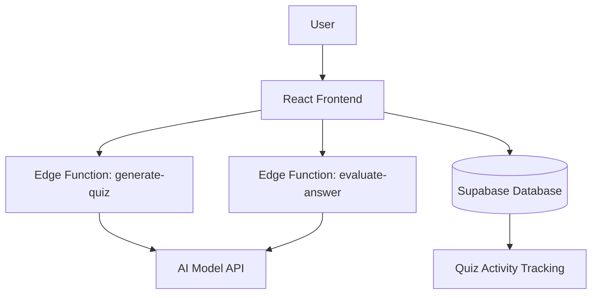
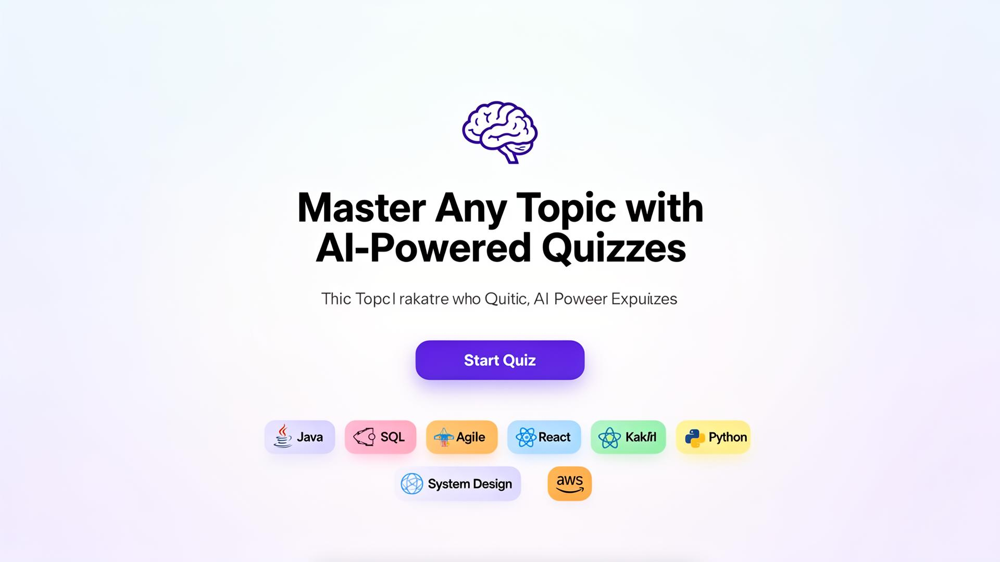
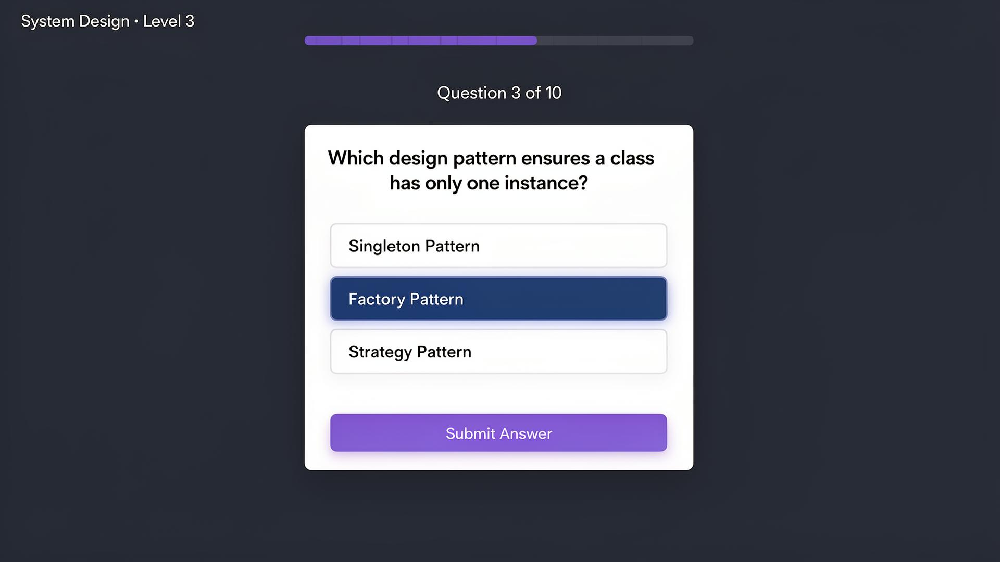
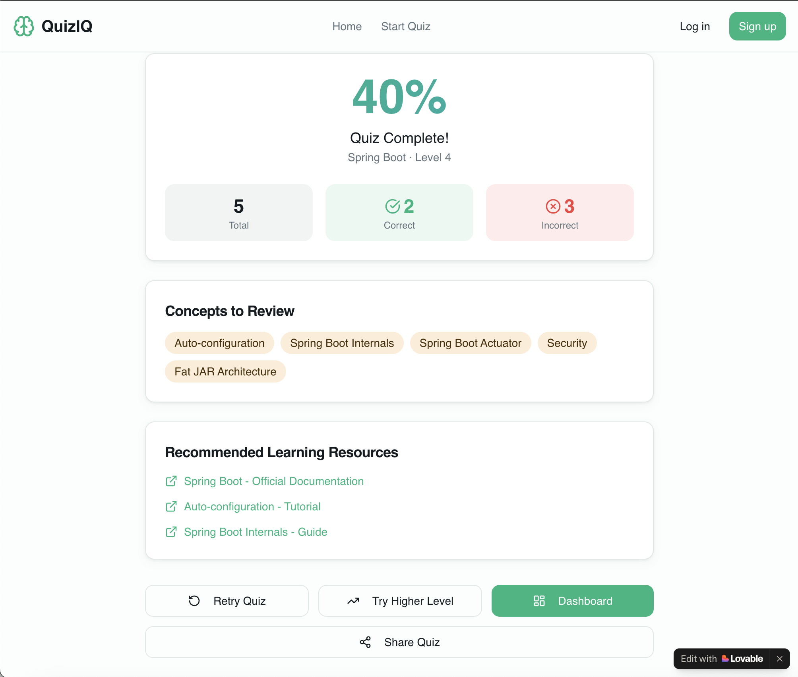

---

# QuizIQ

AI-powered quiz generator that creates questions on **any topic**, evaluates answers, and provides instant feedback.

QuizIQ uses **AI models and serverless edge functions** to dynamically generate quizzes for subjects like programming, business, math, science, and more. Users can practice concepts, receive automated grading, and identify weak areas.

**Live Demo**
[https://quiz-iq.lovable.app](https://quiz-iq.lovable.app)

---

# Features

* AI-generated quizzes on **any custom topic**
* Instant answer evaluation using AI
* Concept-based feedback and explanations
* Works for **technical and non-technical topics**

Example topics:

* System Design
* Java Programming
* Agile Methodology
* Finance Basics
* World History
* Geography
* Math Practice
* Interview Preparation

---

# Example Use Cases

* Practice **coding and system design interviews**
* Learn **business or finance concepts**
* Test knowledge in **school subjects**
* Prepare for **certifications**
* Generate quizzes for **any custom topic**

---

# Architecture

The application uses a **serverless architecture** where AI calls are handled through edge functions.



---

# System Design Overview

### Frontend

React + TypeScript application built with:

* Vite
* Tailwind CSS
* shadcn UI

Responsible for:

* quiz interface
* answer submission
* results display

---

### Edge Functions

Two serverless functions orchestrate the AI logic.

**generate-quiz**

* Sends topic prompt to AI
* Generates structured quiz questions

**evaluate-answer**

* Evaluates user answers
* Provides explanation and score

Edge functions protect API keys and control token usage.

---

### Database

Supabase stores quiz activity and analytics data.

Example data tracked:

* quiz sessions
* user answers
* topic history
* performance insights

---

# Tech Stack

Frontend

* React
* TypeScript
* Vite
* TailwindCSS
* shadcn UI

Backend / Cloud

* Supabase
* Edge Functions

AI

* LLM-based quiz generation
* LLM answer evaluation

Deployment

* Lovable.dev

---

# Project Structure

```
quiz-iq
│
├ public/
├ src/
├ supabase/
│   └ edge-functions
│
├ screenshots/
├ README.md
├ package.json
```

---

# Running Locally

Clone the repository

```
git clone https://github.com/smitagkinger-star/quiz-iq.git
```

Install dependencies

```
npm install
```

Run development server

```
npm run dev
```

---

# Environment Variables

Create a `.env` file based on `.env.example`.

Example:

```
VITE_SUPABASE_URL=
VITE_SUPABASE_ANON_KEY=
OPENAI_API_KEY=
```

Secrets should **never be committed to Git**.

---

# Screenshots

### Landing Page



### Quiz Interface



### Results



---

# Future Improvements

* personalized learning recommendations
* topic difficulty levels
* quiz history dashboard
* spaced repetition learning
* instructor mode for teachers

---

# Author

Smita Kinger

## Development Note

QuizIQ was conceptualized and designed by me.  

The application was implemented using the Lovable.dev AI development platform to accelerate development.

All prompts, feature design, and system architecture decisions were authored and iterated by me.

---